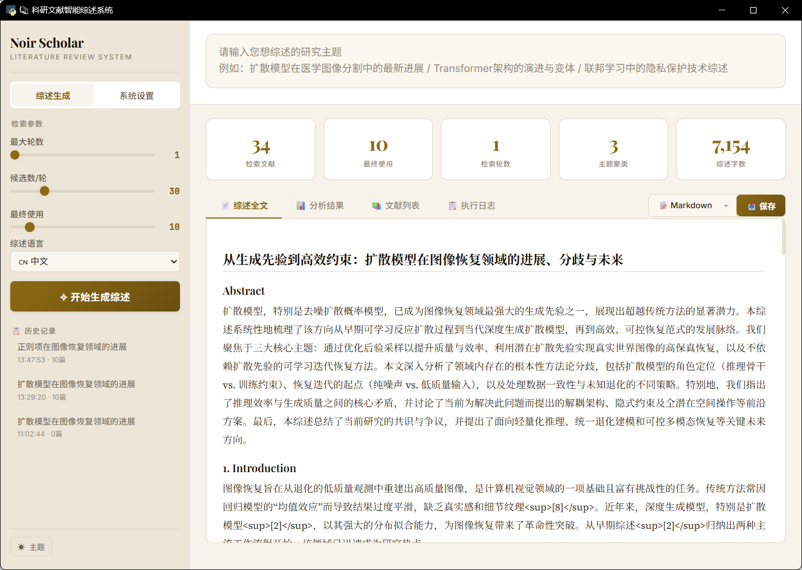
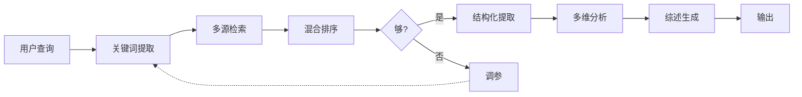
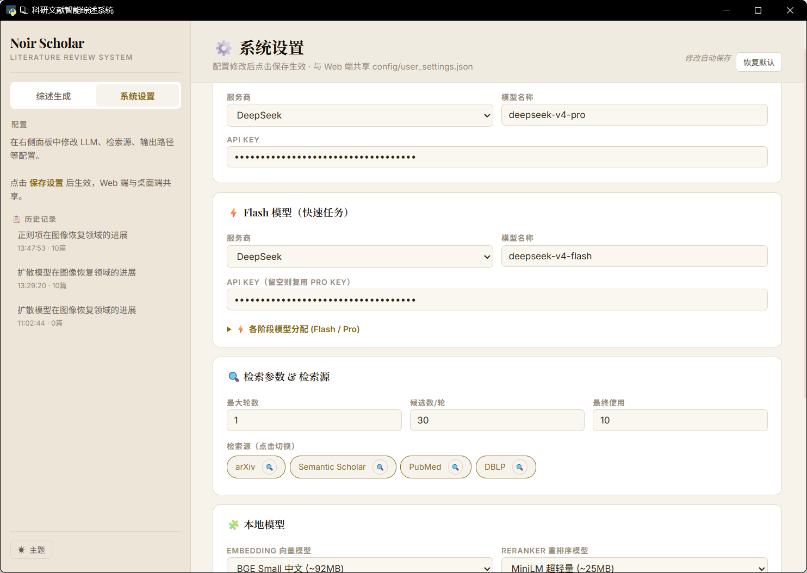

<p align="center">
  
  
  
  
</p>

<h1 align="center">📚 ReviewFlow</h1>
<p align="center"><strong>基于 LangGraph 的多 Agent 科研文献智能综述系统</strong></p>
<p align="center">输入研究方向 → 自动检索 → 深度分析 → 生成综述，全流程自动化</p>

<p align="center">
  
  <br><em>▲ 综述生成页面 — 输入研究方向，实时查看生成进度与最终综述</em>
</p>

---

## ✨ 核心特性

- **🧠 深度 RAG** — 不是朴素"搜论文拼 prompt"。检索 → **结构化提取**（方法/数据集/指标）→ **多维分析**（时间线+聚类+冲突）→ 注入 LLM 生成，综述质量远高于直接拼摘要
- **🔍 混合检索精排** — BM25 稀疏 + Dense 向量双路召回，RRF (k=60) 无监督融合，BGE Cross-Encoder 精排，四阶段检索管线上限更高
- **🔄 自适应检索循环** — 论文不足 10 篇或高质量不足 5 篇时，自动调高 temperature/top_p 重新生成关键词再搜，最多 3 轮自修正，避免死循环
- **⚡ Flash/Pro 双模型** — 简单任务（关键词/引文验证/润色）用 Flash，深度推理（提取/分析/撰写）用 Pro，大幅降成本
- **📦 完全本地化** — ChromaDB 嵌入式向量库 + BGE 模型本地下载 + 双层缓存，无需外部服务，桌面版可离线运行

---

## 🏗️ 系统架构



> 7 个 Agent 通过 LangGraph StateGraph 编排，AgentState (TypedDict) 松耦合通信，ChromaDB + 双层缓存支撑本地 RAG。

<p align="center">
  
  <br><em>▲ 设置页面 — 配置 API、模型、检索参数与检索源</em>
</p>

---

## 🚀 快速开始

### 环境要求

- Python **3.11+**
- Windows / macOS / Linux

### 安装

```bash
# 1. 克隆项目
git clone https://github.com/your-username/ReviewFlow.git
cd ReviewFlow

# 2. 安装依赖
pip install -r requirements.txt
pip install -r desktop/requirements.txt

# 3. 配置 API Key
cp .env.example .env
# 编辑 .env，填写 OPENAI_API_KEY（默认使用 DeepSeek API）
```

### 启动

```bash
# 桌面应用（推荐）
python desktop/main.py

# 或 Web UI
streamlit run src/ui/app.py

# 或 API 服务
python main.py --api

# 或命令行单次查询
python main.py --query "扩散模型在医学图像分割中的最新进展"
```

首次运行会自动下载 BGE 模型到 `models/` 目录（约 2GB），此后的运行无需网络。

---

## 📂 项目结构

```
ReviewFlow/
├── desktop/                 # 桌面应用入口
│   ├── main.py             # PyWebView 入口，ReviewAPI 桥接层
│   ├── app.html / css / js # 前端界面
│   └── run.bat / build.bat # 启动/打包脚本
├── src/
│   ├── agents/             # SupervisorAgent 编排层
│   ├── retrieval/          # 检索子系统
│   │   ├── keyword_extractor.py
│   │   ├── bm25_search.py
│   │   ├── vector_search.py
│   │   ├── rrf.py          # Reciprocal Rank Fusion
│   │   ├── reranker.py     # BGE Cross-Encoder
│   │   └── sources/        # arXiv / PubMed / DBLP / SemanticScholar
│   ├── extraction/         # 结构化提取
│   │   ├── section_splitter.py
│   │   ├── relevance_scorer.py
│   │   └── structured_extractor.py
│   ├── analysis/           # 多维分析
│   │   ├── timeline.py
│   │   ├── clustering.py
│   │   └── conflict.py
│   ├── generation/         # 综述生成
│   │   ├── planner.py
│   │   ├── writer.py
│   │   ├── citation_checker.py
│   │   └── polisher.py
│   ├── graph/              # LangGraph 状态机
│   │   ├── state.py        # AgentState (TypedDict)
│   │   ├── workflow.py     # ReviewWorkflow (StateGraph)
│   │   └── edges.py        # 条件边逻辑
│   ├── storage/            # 存储层
│   │   ├── cache.py        # L1 内存 + L2 磁盘
│   │   └── vector_store.py # ChromaDB 封装
│   ├── config/settings.py  # Pydantic 配置
│   └── ui/app.py           # Streamlit Web UI
├── config/prompts/         # 7 个 Prompt 模板
├── requirements.txt
└── .env.example
```

---

## 🔧 技术栈

| 层级 | 技术 | 说明 |
|------|------|------|
| 编排 | **LangGraph** StateGraph | 有向状态图，7 节点 + 条件边 |
| LLM | LangChain ChatOpenAI | 兼容 OpenAI / DeepSeek 等 |
| 嵌入 | BAAI/bge-small-zh-v1.5 | 768 维，本地运行 |
| 重排序 | BAAI/bge-reranker-v2-m3 | Cross-Encoder 架构 |
| 稀疏检索 | BM25（自研） | 内存索引，TF-IDF |
| 向量存储 | **ChromaDB** | 嵌入式，cosine 相似度 |
| Web | Streamlit / FastAPI | UI + REST API |
| 桌面 | PyWebView + Edge WebView2 | 原生桌面窗口 |

---

## 📐 关键公式

### RRF 倒数秩融合

$$\mathrm{RRF}(d)=\sum_{i=1}^{n}\frac{1}{k+\mathrm{rank}_i(d)},\quad k=60$$

### BM25 稀疏检索

$$\mathrm{BM25}(q,d)=\sum_{i=1}^{n}\mathrm{IDF}(q_i)\cdot\frac{f(q_i,d)\cdot(k_1+1)}{f(q_i,d)+k_1\cdot\left(1-b+b\cdot\frac{|d|}{\mathrm{avgdl}}\right)}$$

---

## ⚙️ 配置参数

| 参数 | 默认值 | 说明 |
|------|--------|------|
| `LLM_MODEL` | `deepseek-v4-pro` | Pro 推理模型 |
| `FLASH_MODEL` | `deepseek-v4-flash` | Flash 快速模型 |
| `SEARCH_MAX_ROUNDS` | `2` | 自适应检索最大轮数 |
| `SEARCH_PAPERS_PER_ROUND` | `25` | 每轮检索论文数 |
| `SEARCH_SOURCES` | `arxiv,…` | 检索源优先级列表 |
| `LLM_MAX_CONCURRENT` | `20` | LLM 并发上限 |
| `EMBEDDING_MODEL` | `BAAI/bge-small-zh-v1.5` | 嵌入模型 |

---

## 📄 License

MIT
